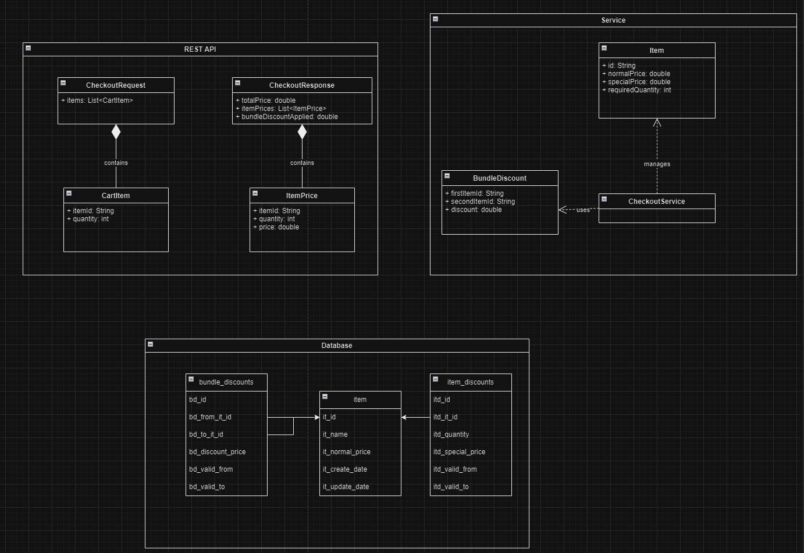

# Checkout Component REST Service

# Overview

Checkout REST service calculating total price of the items in a cart.


### Checkout mechanism

- Calculates the total price of a number of items
    - checkout mechanism scans items and return actual price
    - goods are priced individually
    - some items are multi-priced: buy N of them, and they’ll cost you Y cents

      | Item | Normal Price | Required Quantity | Special Price |
      |------|--------------|-------------------|---------------|
      | A    | 40           | 3                 | 30            |
      | B    | 10           | 2                 | 7.5           |
      | C    | 30           | 4                 | 20            |
      | D    | 25           | 2                 | 23.5          |
    - client receives receipt containing list of all products with corresponding prices
      after payment
    - some items are cheaper when bought together - buy item X with item Y and
      save Z cents

## Environments

| Environment | Address                 |
|-------------|-------------------------|
| DEV         | https://localhost:8092/ |

# Swagger API live documentation

| Environment | Address                                |
|-------------|----------------------------------------|
| DEV         | https://localhost:8092/swagger-ui.html |

# API Endpoints and methods

| URIs           | Summary                                       | GET | PUT | POST               | DEL |
|----------------|-----------------------------------------------|-----|-----|--------------------|-----|
| `/checkout/v3` | calculates total price of the items in a cart |     |     | :heavy_check_mark: |     |

## Getting Started

### Requirements

- Java 19 or higher
- Maven installed

### Build and Run

```bash
mvn clean install
```

### To build JAR

```bash
mvn clean package
```

The JAR file will be created in target folder.

### Run the application using the generated JAR

Open command line and go to project folder and run this command

```bash
java -jar target/checkout-component-3.0.1-SNAPSHOT.jar
```

---

## Design

Service design was first drawn in draw.io and created file is available in folder.

```
src/main/resources/readme/checkout-component-design.drawio
```

Below is an image from draw.io of the component checkout service.



---

## Database

In this first implementation of checkout component version 3.0 database is mocked and populated for demonstration purposes
Next steps for improvement:

- Further improvements: Consider replacing H2 with MySQL or PostgreSQL
- Make Docker image so the service could be installed on Kubernetes or in the cloud like AWS or Microsoft Azure

---

